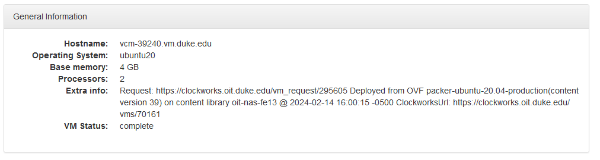

---
output:
  html_document:
    df_print: paged
---
## Get your own Linux
1. Go to [https://vcm.duke.edu/](https://vcm.duke.edu/), login, and click reserve a VM

1. Choose Ubuntu Server 20.04
1. Click your VM and check Host address.

\
\ 

1. Log in in through Terminal (MacOS) or PowerShell (Win). The command prompt may ask if you are sure you want to continue connecting - type "yes"
    ```{bash, eval=FALSE}
    ssh NETID@HOSTNAME
    #example: ssh jan58@vcm-39240.vm.duke.edu
    ```
\ 
1. Enter password of your NetID (not Admin password) - note that the password will be invisible (no dots in terminal). Once you login, you should see your netid at the beginning of the line

\
\ 

## Install Miniconda

```{bash, eval=FALSE}
#go back to home directory
cd
    
#download the installation script - note that once you login, right clicking (not control+v) will paste text into the terminal
wget https://repo.anaconda.com/miniconda/Miniconda3-latest-Linux-x86_64.sh
    
#if `wget` is not available in your OS
#curl -o Miniconda3-latest-Linux-x86_64.sh https://repo.anaconda.com/miniconda/Miniconda3-latest-Linux-x86_64.sh
    
#give permisson to run the installation script
chmod 755 Miniconda3-latest-Linux-x86_64.sh
    
#run installation script
./Miniconda3-latest-Linux-x86_64.sh
    
#hold down enter to pass through the user agreement, then type yes. Click enter to confirm installation path. Type yes when it asks if you wish to update your shell profile...
    
#load you user profile again so the changes can be applied
source .bashrc
```
\ 

## Install qiime2
```{bash, eval=FALSE}
#download the installation script
wget https://data.qiime2.org/distro/amplicon/qiime2-amplicon-2024.2-py38-linux-conda.yml

#install qiime2 in conda environment
conda env create -n qiime2-2024.2 --file qiime2-amplicon-2024.2-py38-linux-conda.yml #take ~5 minutes

#running qiime2 environment - you should see (qiime2-2024.2) at the command line prompt now
conda activate qiime2-2024.2

#check qiime2 is available
qiime --help
```